# Estate Rental - Technical Reference Report

**Version:** 2.0.0  
**Status:** Production-Ready  
**Maintainers:** CTO Office & Architecture Team

---

## I. Vision Stratégique & Écosystème Hybride

Estate Rental représente la convergence de trois paradigmes technologiques majeurs : le **Cloud-Native Computing**, l'**Intelligence Artificielle Prédictive** et la **Décentralisation Web3**. Notre mission est de fournir une plateforme de location immobilière transparente, automatisée et intelligente, capable de scaler horizontalement tout en garantissant une confiance cryptographique entre les parties.

L'architecture repose sur un modèle **Event-Driven Microservices** orchestré sur Kubernetes, enrichi par des moteurs d'inférence IA pour la valorisation des données et un registre distribué Ethereum pour la sécurisation des contrats critiques.

```mermaid
graph LR
    %% Configuration du rendu
    direction LR

    subgraph Init ["⚙️ 1. Setup & Bootstrap"]
        GR[/GitHub: Config Repo/] -->|Fetch| CS[Config Service]
        CS -->|Distribute| MS[[All Microservices]]
    end

    subgraph UserZone ["🌐 2. Client & Web3"]
        U((User Browser / Nx App))
        MM>MetaMask Extension]
        U <-->|Web3 Provider| MM
    end

    subgraph Security ["🛡️ 3. Edge & Security"]
        ALB{AWS ALB}
        GW[API Gateway]
        AUTH[[Authorization Svc]]
        
        U -->|HTTPS/TLS| ALB
        ALB --> GW
        GW <-->|JWT Validation| AUTH
    end

    subgraph Core ["🚢 4. EKS Service Mesh (Private)"]
        subgraph Logic ["Logic Layer"]
            UM[User Svc]
            PM[Property Svc]
            RA[[Rental Agreement V2]]
        end
        
        subgraph Support ["Async & Intelligence"]
            AI[/AI Engine: FastAPI/]
            K((Apache Kafka))
            NS[Notification Svc]
        end

        GW --> Logic
        PM -.->|Internal Request| AI
        RA -.->|Event Stream| K
        K -.->|Process| NS
    end

    subgraph Persistence ["💾 5. Data & Trust Layer"]
        RDS[(Amazon RDS MySQL)]
        ETH{{Ethereum Blockchain}}
        
        Logic & Support --> RDS
        RA <-->|Smart Contract| ETH
    end

    %% Styles Uniformes "RDS Steel Gray"
    classDef default fill:#eceff1,stroke:#546e7a,stroke-width:1px,color:#263238;
    classDef specialized fill:#cfd8dc,stroke:#455a64,stroke-width:2px,color:#263238;

    class CS,GW,UM,PM,NS,U,ALB,RDS default;
    class AUTH,RA,AI,K,ETH,MM specialized;

    %% Overrides spécifiques pour le contraste
    style ETH fill:#3c3c3d,color:#fff
    style ALB stroke:#232f3e,stroke-width:2px
```

---

## II. Architecture Infrastructure (Deep Cloud)

L'infrastructure est entièrement définie en **Infrastructure as Code (IaC)** via Terraform, garantissant reproductibilité et immuabilité. Le déploiement cible la région AWS `eu-north-1 (Stockholm)` pour des raisons de conformité RGPD et de latence.

### 1. Topologie EKS (Elastic Kubernetes Service)
Le cluster `estate-rental-cluster` (v1.29) est le cœur opérationnel de la plateforme. Il est conçu pour une haute disponibilité et une isolation stricte des charges de travail.

*   **Control Plane**: Géré par AWS, accessible via un endpoint public/privé sécurisé.
*   **Data Plane (Node Groups)**:
    *   **Groupe**: `estate-rental-nodes`
    *   **Instance Type**: `m7i-flex.large` (Intel Sapphire Rapids, 2 vCPU, 8 GiB RAM). Ce choix offre un excellent ratio performance/coût pour les workloads Java (JVM) et Python (ML Inference).
    *   **Scaling**: Configuré avec un `desired_size` de 3 nœuds, extensible automatiquement à 4 (`max_size`) via le Cluster Autoscaler en cas de pic de charge.
    *   **Réseau**: Les nœuds sont déployés exclusivement dans des **Private Subnets** pour isoler les workloads d'Internet.

### 2. Exposition & Résilience
*   **AWS Load Balancer Controller**: Agit comme Ingress Controller, provisionnant dynamiquement des Application Load Balancers (ALB) pour exposer la Gateway et les services publics.
*   **OIDC Provider**: Intégré pour permettre aux Pods d'assumer des rôles IAM (IRSA - IAM Roles for Service Accounts), éliminant le besoin de clés d'accès statiques.
*   **Incident Management**: Suite à l'incident de janvier 2026 (latence AWS Health), les outils clients (`kubectl`, `aws-cli`) et les agents de monitoring ont été mis à jour pour assurer une résilience accrue face aux dégradations du plan de contrôle.

---

## III. Catalogue des Microservices (The Java Core)

Le backend est une constellation de microservices **Spring Boot 3.x**, communiquant de manière synchrone (REST/OpenFeign) et asynchrone (Kafka).

### 1. Config Service (`config-service-rental-estate`)
*   **Rôle**: Serveur de configuration centralisé.
*   **Backend**: Git-backed (`https://github.com/RealEstate-Rental-Project/config-repo-estate-rental.git`).
*   **Fonction**: Distribue les configurations dynamiques (hot-reload) à tous les autres services au démarrage.

### 2. Gateway Service (`gateway-estate-rental-service`)
*   **Rôle**: Point d'entrée unique (Edge Server).
*   **Tech**: Spring Cloud Gateway.
*   **Fonctions**: Routage dynamique, Rate Limiting, et agrégation de documentation API. Il expose les métriques Prometheus pour l'observabilité globale.

### 3. User Management Service (`user-management-estate-rental-service`)
*   **Rôle**: Gestion des identités et des profils (Locataires, Propriétaires, Admins).
*   **Sécurité**: Intégration avec `authorization-service` pour la validation des tokens JWT.

### 4. Property Management Service (`backend-property-management-microservice`)
*   **Rôle**: Gestion du cycle de vie des annonces immobilières.
*   **Interactions**: Notifie le `Recommendation Engine` lors de la création de nouvelles propriétés pour mise à jour des clusters.

### 5. Notification Service (`notification-estate-rental-service`)
*   **Architecture**: Event-Driven Consumer.
*   **Source**: Écoute les topics Kafka (`contract-events`, `payment-events`).
*   **Action**: Envoie des emails transactionnels et des notifications push en temps réel.

### 6. Authorization Service (`authorization-service`)
*   **Rôle**: Serveur OAuth2 / OIDC. Délivre et signe les JWT.

### 7. Rental Agreement Service (`Rental-Agreement-Microservice-V2`)
*   **Rôle**: Orchestrateur des contrats de location et miroir d'état (State Mirror) pour la Blockchain.
*   **Fonctions**: Gère la machine à états des contrats (`PENDING`, `ACTIVE`, `DISPUTED`), la réconciliation des paiements et la levée des litiges.
*   **Interactions**: Synchronise les événements Blockchain (via le frontend) et notifie les parties prenantes via Kafka.

---

## IV. Moteurs d'Intelligence Artificielle

L'intelligence de la plateforme est déportée dans des microservices Python (FastAPI), optimisés pour le calcul matriciel.

### 1. Predictive Heatmaps (`Predictive-heatmaps-of-neighborhood-price-evolution`)
*   **Objectif**: Visualiser les tendances du marché immobilier par quartier.
*   **Algorithme**:
    *   **Clustering**: `K-Means` sur les matrices de croissance (Growth Patterns) pour segmenter les quartiers en "HOT" (>2% croissance), "COOL" (<-2% baisse) ou "STABLE".
    *   **Forecasting**: `LinearRegression` sur les séries temporelles historiques pour prédire les prix à 6 mois.

### 2. Recommendation Engine (`Property-Recommendation-Engine-K-MEANS-Cosine-Similarity`)
*   **Objectif**: Suggérer des biens pertinents aux utilisateurs.
*   **Pipeline**:
    1.  **Filtrage (Coarse-grained)**: Un modèle `K-Means` assigne l'utilisateur à un cluster de propriétés basé sur ses préférences (Budget, Surface, Localisation).
    2.  **Ranking (Fine-grained)**: Calcul de la `Cosine Similarity` entre le vecteur utilisateur et les vecteurs des propriétés candidates du cluster.
    *   **Features**: `normalized_rent`, `Total_Rooms`, `SqM`, `latitude`, `longitude`.

### 3. Tenant Risk Scoring (`Tenant-Risk-Scoring-RandomForestClassifier`)
*   **Objectif**: Évaluer la fiabilité financière d'un locataire.
*   **Modèle**: `RandomForestClassifier` (Ensemble Learning).
    *   **Hyperparamètres**: 100 arbres (`n_estimators=100`), profondeur max 10 (`max_depth=10`).
    *   **Features**: `missedPeriods` (Périodes impayées), `totalDisputes` (Litiges passés).
*   **Formulation**:
    Le score de risque $S$ est dérivé de la probabilité de classe positive (défaillance) :
    $$ S(x) = \frac{1}{N} \sum_{i=1}^{N} I(h_i(x) = \text{Risky}) $$
    Où $N$ est le nombre d'arbres et $h_i(x)$ la prédiction de l'arbre $i$.

---

## V. Couche Blockchain & Smart Contracts

Nous adoptons une approche **Hybride** pour combiner la confiance du Web3 avec la performance du Web2.

### Rental Agreement Microservice V2
Ce service Java agit comme un **Off-chain Indexer** et un **State Mirror**.
*   **Flux de Création**:
    1.  Le **Frontend** initie la transaction sur Ethereum (Smart Contract) via `blockchain.service.ts` (Ethers.js).
    2.  Une fois la transaction minée, le frontend envoie le `agreementIdOnChain` et le `txHash` au backend.
    3.  Le backend crée un `RentalContract` en base de données avec le statut `PENDING_RESERVATION`.
*   **Livraison des Clés**:
    1.  Le locataire confirme la réception sur la Blockchain.
    2.  Le backend met à jour l'état local vers `ACTIVE` via `updateKeyDeliveryStatus`, débloquant le paiement (Off-chain representation).
*   **Avantage**: Cette architecture évite la latence de lecture blockchain pour les opérations courantes (listing, recherche) tout en garantissant que l'état critique (l'accord) est immuable sur Ethereum.

---

## VI. Frontend Engineering (Nx Monorepo)

Le frontend est structuré autour d'un **Monorepo Nx**, favorisant le partage de code et la cohérence architecturale.

*   **Apps**:
    *   `public-app`: Application principale (Client & Propriétaire). Gère la recherche, la réservation et le dashboard utilisateur.
*   **Architecture**:
    *   **Modularité**: Utilisation intensive de bibliothèques partagées (UI Kits, Services API, Utils).
    *   **Web3 Integration**: Services dédiés (`BlockchainService`) pour l'injection du provider Ethereum (Metamask) et la signature des transactions.

---

## VII. Pipeline CI/CD & Observability

L'industrialisation est assurée par un pipeline Jenkins déclaratif.

### Observabilité
*   **Prometheus**: Scraping des métriques JVM, CPU et Business (via Micrometer) exposées par les endpoints Actuator des microservices.
*   **Grafana**: Visualisation des dashboards (Santé des nœuds EKS, Latence API, Throughput Kafka).
*   **SonarQube**: Analyse statique du code (Quality Gate) intégrée au pipeline pour bloquer les régressions techniques.
